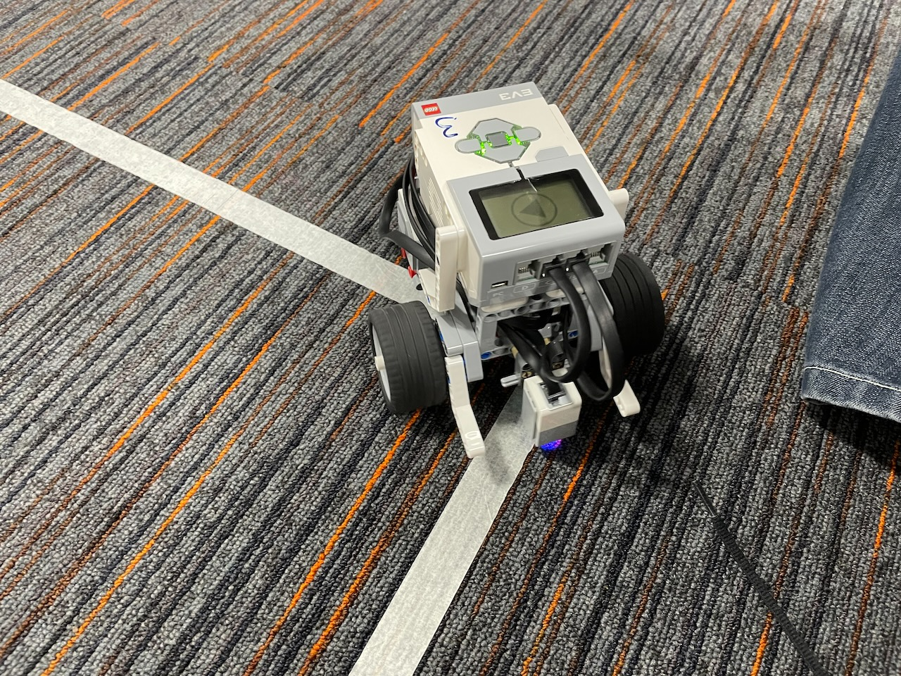
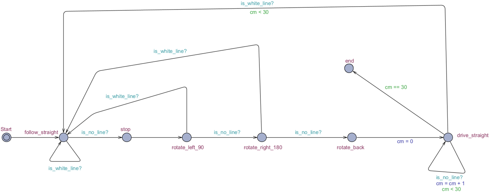
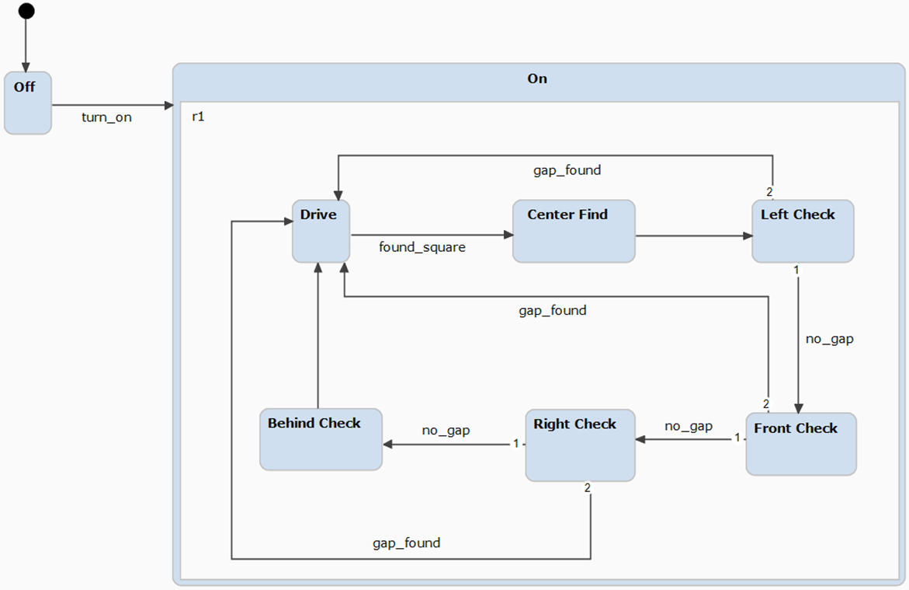

# Task 1: Analysing Sensors

1. **Document values with the different**

_Light sensor on blue carpet_

| Distance (mm) | Value 1 | Value 2 | Value 3 | Value 4 | Value 5 | Value 6 | Value 7 | Mean     | Std. Deviation |
| ------------- | ------- | ------- | ------- | ------- | ------- | ------- | ------- | -------- | -------------- |
| 5             | 100     | 100     | 100     | 100     | 100     | 100     | 100     | 100      | 0              |
| 25            | 32      | 27      | 26      | 27      | 25      | 29      | 26      | 27.42857 | 2.194613       |
| 50            | 5       | 8       | 7       | 7       | 7       | 7       | 6       | 6.714286 | 0.880631       |
| 100           | 1       | 2       | 1       | 2       | 2       | 1       | 1       | 1.428571 | 0.494872       |

_Light sensor on white line_

| Distance (mm) | Value 1 | Value 2 | Value 3 | Value 4 | Value 5 | Value 6 | Value 7 | Mean     | Std. Deviation |
| ------------- | ------- | ------- | ------- | ------- | ------- | ------- | ------- | -------- | -------------- |
| 5             | 14      | 16      | 15      | 16      | 13      | 12      | 14      | 14.28571 | 1.385051       |
| 25            | 4       | 4       | 4       | 4       | 4       | 4       | 4       | 4        | 0              |
| 50            | 0       | 1       | 0       | 1       | 0       | 1       | 0       | 0.428571 | 0.494872       |
| 100           | 0       | 0       | 0       | 0       | 0       | 0       | 0       | 0        | 0              |

_Ultrasonic sensor_

| Distance (mm) | Value 1 | Value 2 | Value 3 | Value 4 | Value 5 | Value 6 | Value 7 | Mean     | Std. Deviation |
| ------------- | ------- | ------- | ------- | ------- | ------- | ------- | ------- | -------- | -------------- |
| 5             | 2550    | 2550    | 2550    | 2550    | 2550    | 2550    | 2550    | 2550     | 0              |
| 25            | 32      | 32      | 32      | 32      | 32      | 32      | 32      | 32       | 0              |
| 50            | 55      | 51      | 50      | 50      | 50      | 51      | 51      | 51.14286 | 1.641304       |
| 100           | 101     | 107     | 103     | 103     | 103     | 101     | 107     | 103.5714 | 2.321154       |
| 250           | 250     | 251     | 251     | 251     | 251     | 251     | 251     | 250.8571 | 0.349927       |
| infinity      | 2550    | 2550    | 2550    | 2550    | 2550    | 2550    | 2550    | 2550     | 0              |

_Gyroscopic sensor_

| Angle (degrees) | Value 1 | Value 2 | Value 3 | Value 4 | Value 5 | Value 6 | Value 7 | Mean     | Std. Deviation |
| --------------- | ------- | ------- | ------- | ------- | ------- | ------- | ------- | -------- | -------------- |
| 90              | 90      | 89      | 95      | 91      | 90      | 83      | 90      | 89.71429 | 3.282607       |
| 180             | 187     | 185     | 183     | 169     | 184     | 184     | 183     | 182.1429 | 5.51436        |
| 270             | 274     | 270     | 272     | 264     | 264     | 251     | 261     | 265.1429 | 7.259055       |
| 360             | 333     | 334     | 345     | 347     | 345     | 353     | 365     | 346      | 10.18402       |
| 720             | 710     | 717     | 713     | 693     | 697     | 716     | 706     | 707.4286 | 8.633111       |
| 1080            | 1045    | 1060    | 1068    | 1044    | 1043    | 1029    | 1044    | 1047.571 | 11.7699        |

2. **Discuss the reliability of the sensors based on your findings.**

   All sensors appear to work as intended. Most of these sensors appear to be
   consistent with their recorded values and close to the intended value. Only
   exception is the gyroscopic sensor, which had varying readings from one
   sensor to another. This makes the gyroscopic sensor not suitable for most of
   the tasks in lab due to it's inconsistency.

   Another notably issue is that the ultrasonic sensor doesn't seem to pick up
   objects where they are incredibly close. Anywhere between 5mm and 24mm this
   thresehold is found. This is evident when it produces the value of the
   distance between and the object in front at the max distance value it can
   measure, though this drops back to a more excepted value at 25mm.

   The colour sensor doesn't also seem to be perfect at short distances. Though
   its measurements seem to be fine on the white line, likely due to its
   reflectivey, the colour sensor doesn't seem to pick up the carpet very well,
   showing a max value for 5mm, but dropping back to something more expected at
   25mm.

# Task 2: Testing Motors

1.**Document values from the experiments.** (4 in total):

    Repeat each experiment 7 times. Record values in a spreadsheet and compute mean
    and standard deviation of the recorded values.

_Straight line_

| Speed        | Value 1(cm) | Value 2(cm) | Value 3(cm) | Value 4(cm) | Value 5(cm) | value 6(cm) | Value 7(cm) | Mean     | Std. Deviation |
| ------------ | ----------- | ----------- | ----------- | ----------- | ----------- | ----------- | ----------- | -------- | -------------- |
| slow (60)    | 135         | 82          | 293         | 74          | 164         | 34          | 128         | 130      | 77.83683       |
| medium (120) | 34          | 125         | 114         | 140         | 37          | 73          | 215         | 105.4286 | 59.15321       |
| fast (240)   | 50          | 60          | 162         | 30          | 60          | 56          | 41          | 65.57143 | 40.6443        |

2. **Discuss the reliability of the motors based on your findings.**

# Task 3: Spot Finding

1. **Document selection of sensors with justification.**

   One sensor we used is the colour sensor. The purpose of the sensor is to
   detect when the colour changes from the current floor colour to white so it
   knows that it has reached the white spot and needs to change directions.

   Another sensor we used is the gyro sensor. The purpose of this sensor is to
   know when the driving base has turned exactly 180 degrees before moving again
   because once it reaches the white spot, it needs to go in the reverse
   direction.

2. **Provide a picture of the driving base with the selected sensor(s).**

   

3. **Document the algorithmic idea.**

   The algorithmic idea is that the driving base is intended to go straight and
   while it is going straight it should continually check if the colour sensor
   has picked up the white spot. Once it reaches the white spot, the driving
   base needs to stop and continually rotate until the gyro sensor picks up the
   next occurrence of 180 degrees from the gyro sensor so it is able to go in
   the reverse of the direction it was originally going. It needs to complete
   all of these steps 10 times.

4. **Document the algorithm in pseudo-code.**

   ```pseudocode
   ev3 = new EV3Brick()
   leftMotor = new Motor(Port.B)
   rightMotor = new Motor(Port.B)
   lineSensor = new ColorSensor(Port.S1)
   gyroSender = new GyroSensor(Port.S3)
   speed = 300 rotatation = speed / 2

   for i=0 to 9
   	leftMotor.run(speed)
   	rightMotor.run(speed)

   	while true
   		if lineSensor.color == Color.WHITE then
   			leftMotor.hold()
   			rightMotor.hold()
   			leftMotor.run(rotation)
   			rightMoto.run(0 – rotation)
   			while gyroSensor.angle() < (180 * (i + 1))
   				continue
   			endwhile
   			leftMotor.hold()
   			rightMotor.hold()
   			BREAK
   		endif
   	endwhile
   next i

   ```

5. **Provide well-commented MicroPython source code of the implementation.**

   ```python
   #!/usr/bin/env pybricks-micropython
   from pybricks.hubs import EV3Brick
   from pybricks.ev3devices import (Motor, TouchSensor, ColorSensor,
   								 InfraredSensor, UltrasonicSensor, GyroSensor)
   from pybricks.parameters import Port, Stop, Direction, Button, Color
   from pybricks.tools import wait, StopWatch, DataLog
   from pybricks.robotics import DriveBase
   from pybricks.media.ev3dev import SoundFile, ImageFile

   #Variables
   ev3 = EV3Brick()
   left_motor = Motor(Port.B)
   right_motor = Motor(Port.D)
   line_sensor = ColorSensor(Port.S1)
   gyro_sensor = GyroSensor(Port.S3)
   gyro_sensor.reset_angle(0)
   speed = 300
   rotation = speed / 2

   for i in range(0, 10, 1):

   	#Moves straight for next turn
   	ev3.speaker.say("Turn " + str(i + 1) + ", Gyro Value " + str(gyro_sensor.angle()))
   	left_motor.run(speed)
   	right_motor.run(speed)

   	#Continually looks for the white sport
   	run = True
   	while (run):
   		if (line_sensor.color() == Color.WHITE):

   			#Stops when finds white spot
   			left_motor.hold()
   			right_motor.hold()

   			#Rotates 180 degress
   			left_motor.run(rotation)
   			right_motor.run(0 - rotation)
   			while (gyro_sensor.angle() < (180 * (i + 1))):
   				continue

   			#Stops rotating
   			left_motor.hold()
   			right_motor.hold()
   			run = False

   ev3.speaker.say("Mission Success")
   ```

# Task 4 : Line-with-gaps follower



The broken line track will respect the following rules:

- Gaps will only occur on straight parts of the line

- Gaps may vary in length, but will be limited to a maximum of 30cm;

- You may again modify the hardware design, and use any sensors to solve this
  task.

1. **Document the Hardware Design (include a picture).**

   > _Hardware used:_
   >
   > - Color Sensor

   In order to complete this task we were required to use a “colour sensor”. The
   colour sensor would try to detect the white lines and keep on following them.
   We also tried to use a “Gyro sensor” in order to make the micro-python coding
   less confusing but the “Gyro sensor” would not work, the values one the
   “Gyro” where not accurate values. We thought of adding a ”Gyro sensor” in
   order to keep/make our “EV3 robot” to move straight because most of the times
   the robot would go little off track when making turns or even on straight
   lines but unfortunately the “Gyro sensor” values were neither accurate nor
   sensitive enough for the application.

   We also faced some difficulties due to the duck tape placed on the floor,
   because at some places of the path were more darker than the other part of
   the tape therefore the colour sensor would easily get messed up with
   detecting the threshold of the white colour.

2. **Develop the Software Design (by either a timed automaton or a
   StateChart).**

   

3. **Develop the algorithm in pseudo-code (with clear association with elements
   in the software design).**

   ```sql
   BEGIN
   	CHECK color

   	::x:: <- WHILE (color IS white)
   		GO straght
   	TURN left
   	CHECK color
   	IF (color IS white)
   		GOTO x

   	TURN 180
   	IF (color IS white)
   		GOTO x
   END
   ```

4. Implement the algorithm in MicroPython (provide a well commented code
   listing).

   `FILE: new.py`

   ```python
   #!/usr/bin/env pybricks-micropython
   from pybricks.hubs import EV3Brick
   from pybricks.ev3devices import (Motor, TouchSensor, ColorSensor,
   								 InfraredSensor, UltrasonicSensor, GyroSensor)
   from pybricks.parameters import Port, Stop, Direction, Button, Color
   from pybricks.tools import wait, StopWatch, DataLog
   from pybricks.robotics import DriveBase
   from pybricks.media.ev3dev import SoundFile, ImageFile
   import math

   def straight():
   	deviation = line_sensor.reflection() - threshold
   	turn_rate = proportional_gain * deviation
   	robot.drive(speed, turn_rate)
   	wait(10)

   def dash():
   	left_motor.reset_angle(0)
   	robot.drive(dashSpeed, 0)
   	while(True):
   		if (left_motor.angle() > dashDistance):
   			robot.stop()
   			break

   def rotate():
   	#Turn Left
   	for i in range(0,9):
   		robot.turn(-10)
   		print(i)
   		if (line_sensor.reflection() > black):
   			robot.turn(-15)
   			return
   	robot.turn(90)

   	#Turn Right
   	for i in range(0,9):
   		robot.turn(10)
   		print(i)
   		if (line_sensor.reflection() > black):
   			robot.turn(15)
   			return
   	robot.turn(-90)

   	#Drive until white line or 30cm
   	for i in range(0,6):
   		robot.straight(50)
   		if (line_sensor.reflection() > black):
   			break
   	robot.stop()


   #Variables
   left_motor = Motor(Port.B)
   right_motor = Motor(Port.C)
   line_sensor = ColorSensor(Port.S4)
   robot = DriveBase(left_motor, right_motor, wheel_diameter=55.5, axle_track=104)
   speed = 200
   turn = speed / 2
   dashSpeed = speed / 2
   dashDistance = 63
   black = 15
   white = 76
   threshold = (black + white) / 2
   proportional_gain = 1.4

   while True:
   	while (line_sensor.reflection() > black):
   		straight()
   	if (line_sensor.reflection() <= black):
   		robot.stop()
   		dash()
   		rotate()
   ```

# Task 5: Line Following

1. **Document the Hardware Design (include a picture).**

   > _Hardware used:_
   >
   > - Color Sensor

   This task was a bit more challenging than the previous one because we had to
   deal with sharp turns an almost semi-circle turns. The speed of the robot
   played a huge role in this task, because sometimes the robot would make a
   turning faster than it should and the colour sensor was not able to detect
   the white line of the path. So we had to play with the proportionality of the
   wheel spin(the turnings) and the speed. As I also mentioned before a drawback
   was the colour or how the tape was placed on the floor

2. **Develop the Software Design (by either a timed automaton or a
   StateChart).**

   

3. Develop the algorithm in pseudo-code (with clear association with elements in
   the software design).

   ```sql

   ```

4. Implement the algorithm in MicroPython (provide a well commented code
   listing).

   `FILE: lt5.py`

   ```python
   #!/usr/bin/env pybricks-micropython

   # Import the necessary libraries
   from pybricks.parameters import *
   from pybricks.hubs import EV3Brick
   from pybricks.ev3devices import *
   from pybricks.tools import wait
   from pybricks.robotics import DriveBase

   # Create the sensors and motors objects
   ev3 = EV3Brick()

   motorA = Motor(Port.A)
   motorB = Motor(Port.B)
   left_motor = motorA
   right_motor = motorB

   color_sensor_in1 = ColorSensor(Port.S1)


   def move_tank_dc(left, right):
       left_motor.dc(left)
       right_motor.dc(right)


   def move_tank(left, right):
       left_motor.run(left)
       right_motor.run(right)


   def move_steer(speed, steer):
       # init l_speed and r_speed to same values
       l_speed = speed
       r_speed = speed

       gain = (threshold - abs(float(steer))) / threshold

       if steer >= 0:
           r_speed *= gain
       else:
           l_speed *= gain

       if abs(steer) < 2.0:
           # full speed
           move_tank_dc(70.0, 70.0)
       else:
           move_tank_dc(l_speed, r_speed)


   # Here is where your code starts
   # colour values for line detection. Calibrate these for every sensor.
   BLACK = 3
   WHITE = 60
   threshold = (BLACK + WHITE) / 2.0

   # drive speed and proportional gain for turning rate
   DRIVE_SPEED = 160.0
   PROPORTIONAL_GAIN = 1.60


   # ==================== MAIN LOOP ====================
   while True:
       # Calculate the deviation from the threshold.
       deviation = threshold - color_sensor_in1.reflection()

       # Calculate the turn rate. e.g. 2.5 * 10 = 25 deg/s
       turn_rate = PROPORTIONAL_GAIN * deviation
       speed = DRIVE_SPEED

       move_steer(speed, turn_rate)

       # wait(10)
   ```

# Task 6: Maze Solver

1. **Document the Hardware Design (include a picture).**

   > _Hardware used_
   >
   > - Ultrasonic sensor
   > - Color sensor

   In this task we have used the “Ultrasonic sensor” to detect the distance from
   each block while the EV3 is moving towards it. A “Colour sensor” is used
   because on the ground there is a white tape for each rectangle. Therefore, we
   are using the light sensor to as soon as it catches a white line to move 2-3
   cm more forward and then try to scan the area by turning left, right or
   forwards to scan the place to see which distance is the greatest in order to
   continue its journey. This will make the robot move to the greatest distance
   not to hit the blocks.

2. Develop the Software Design (by either a timed automaton or a StateChart).

   

3. Develop the algorithm in pseudo-code (with clear association with elements in
   the software design).

   ```sql

   ```

4. Implement the algorithm in MicroPython (provide a well commented code
   listing). `lt6.py`

   ```python
    #!/usr/bin/env pybricks-micropython
    from pybricks.hubs import EV3Brick
    from pybricks.ev3devices import (Motor, TouchSensor, ColorSensor,
                                     InfraredSensor, UltrasonicSensor, GyroSensor)
    from pybricks.parameters import Port, Stop, Direction, Button, Color
    from pybricks.tools import wait, StopWatch, DataLog
    from pybricks.robotics import DriveBase
    from pybricks.media.ev3dev import SoundFile, ImageFile

    # Turn
    def check():

        #Left
        robot.turn(first_turn)
        robot.turn(first_turn)
        robot.turn(first_turn)
        print(ultrasonic.distance())
        if (ultrasonic.distance() > wall):
            print("LEFT")
            print(" ")
            return

        #Forward
        robot.turn(second_turn)
        robot.turn(second_turn)
        robot.turn(second_turn)
        print(ultrasonic.distance())
        if (ultrasonic.distance() > wall):
            print("FORWARD")
            print(" ")
            return

        #Right
        robot.turn(second_turn)
        robot.turn(second_turn)
        robot.turn(second_turn)
        print(ultrasonic.distance())
        if (ultrasonic.distance() > wall):
            print("RIGHT")
            print(" ")
            return

        #Back
        robot.turn(second_turn)
        robot.turn(second_turn)
        robot.turn(second_turn)
        print(ultrasonic.distance())
        if (ultrasonic.distance() > wall):
            print("BACK")
            print(" ")
            return

        print("ERROR!!!")
        print(" ")

    # Components
    left_motor = Motor(Port.A)
    right_motor = Motor(Port.B)
    ultrasonic = UltrasonicSensor(Port.S2)
    line_sensor = ColorSensor(Port.S1)
    robot = DriveBase(left_motor, right_motor, wheel_diameter=55, axle_track=142)

    # Values
    speed = 200
    white = 20
    middle = 28
    wall = 250
    right = 30
    left = - right
    first_turn = 0
    second_turn = 0

    # while True:
    #     robot.turn(left)
    #     robot.turn(left)
    #     robot.turn(left)
    #     robot.turn(right)
    #     robot.turn(right)
    #     robot.turn(right)

    # Hardcode
    robot.drive(speed, 0)
    while True:
        if (line_sensor.reflection() > white):
            robot.straight(middle)
            print(ultrasonic.distance())
            if (ultrasonic.distance() < wall):
                robot.turn(left)
                robot.turn(left)
                robot.turn(left)
                first_turn = left
                second_turn = right
            else:
                first_turn = right
                second_turn = left
            break

    # Main
    while True:
        robot.drive(speed, 0)
        if (line_sensor.reflection() > white):
            robot.straight(middle)
            check()
   ```
